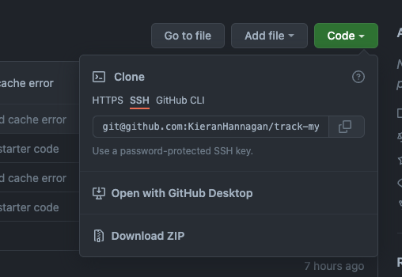
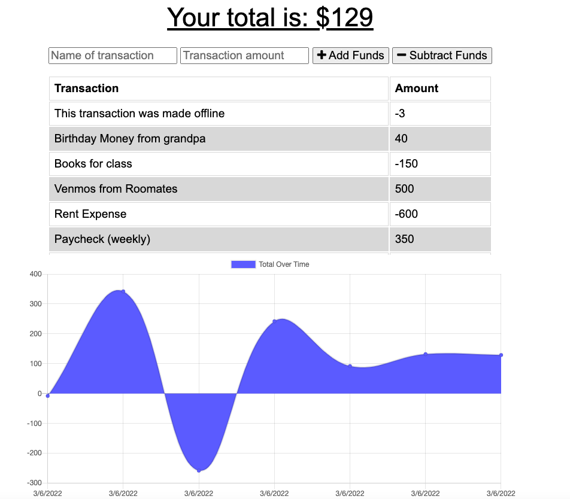
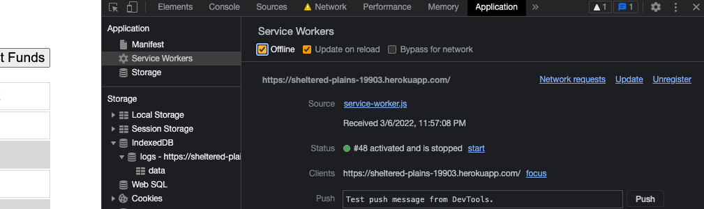

# track-my-budget
          
  ## Description
This application allows the user to keep their finances in check, wherever they are. It has offline functionality and can be downloaded straight to your mobile device. It is a node.js PWA application that uses MongoDB for database handling and Express.js for its servers. 

This app has a `Service Worker` and a `Manifest` that allows it to work and collect data without any internet connection (IndexedDB). It does this by caching your data locally then uploading it when it has a connection.
  
  * [Installation](#installation)
  * [Usage](#usage)
  * [Test](#tests)
  * [Questions](#questions)
  * [GitHub](#github)
  * [Email](#email)
  
  ## Installation 

  Clone the repo in your terminal using shell and navigate to your newly cloned directory. You will then want to open the file in your preferred coding software.

 

  ### MongoDB
This is hooked up to my own database via mongoDB, it is connected and deployed via Heroku, there is nothing you have to do in order to use the [deployed app](https://sheltered-plains-19903.herokuapp.com/), but if you want to run it locally you will have to do the following:

   * Navigate to the cloned directory
   * Perform the `npm install` command in your terminal to install the node js dependencies. 
   * Perform the `npm start` command to start the express server.
   * Go to `localhost:3001` and start tracking your budget!

  ## Usage 
This application uses Node.js dependencies, here is the list of packages that should come ready in your `package.json` :

            "dependencies": {
        "compression": "^1.7.4",
        "express": "^4.17.1",
        "mongoose": "^5.5.15",
        "morgan": "^1.9.1"
        }

You can create a new transaction by entering a `name` and `amount` and either clicking `add` or `subtract` funds. It will then update the chart and display a visual representation of your current budget. It will also display your current total balance in large text at the top.

  ## Tests 
  To test the offline functionality, open chrome dev tools and navigate to the `Application` tab. You can click `Service Workers` to make sure it loaded to the page properly. You can then check `offline` and refresh the page, if you enter a transaction you should still see the app on your screen. If you un-click the `offline` checkbox and refresh again, it will automatically update the data base upon internet restoration.

  ## Questions
  If you have any questions, feel free to reach out and contact me via email.
  ### Email
  kieranhan1999@gmail.com
  ### GitHub
  www.github.com/KieranHannagan
  

  